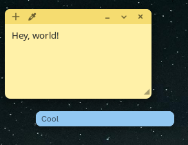

# GNOME extensions

Two kinds of GNOME Shell extension live here, kept in separate folders, all targeting **GNOME 50**:

| Folder | What's in it |
|---|---|
| [`own/`](own) | Extensions **I wrote from scratch**. |
| [`patched/`](patched) | **Third-party extensions I've vendored and patched** because upstream is unmaintained or hasn't caught up with GNOME 50. Each is a pristine upstream commit followed by my fixes, so `git log -p patched/<name>` shows exactly what changed. |

## Own extensions

| Extension | What |
|---|---|
| [`sticky-notes`](own/sticky-notes) | Minimal macOS-Stickies-style notes for the desktop. See below. |

## Patched extensions

| Extension | Upstream | What I changed |
|---|---|---|
| [`media-controls`](patched/media-controls) | [sakithb/media-controls](https://github.com/sakithb/media-controls) (archived) | GNOME 50 click/slider fixes and 51 metadata, taken from community forks. Tracked in [`tracking/`](tracking) until upstream (or a successor) supports GNOME 50 again. |

Patched extensions are not mine: credit and licences stay with the upstream authors. `tracking/<uuid>.md` records each one's upstream, pinned commit, applied fixes and alternatives, and `scripts/check-upstream.sh` reports when a fork can be dropped.

## Sticky Notes



- Notes float above your windows, in six colours (Yellow, Blue, Green, Pink, Purple, Gray).
- **Double-click a note's header to collapse it** to a thin bar showing the first line of text.
- Header: `+` new note, colour cycle on the left; minimize, collapse and delete on the right (GNOME window-control order). Buttons appear on hover and have tooltips.
- Drag the header to move, drag the corner `◢` to resize.
- Minimized notes live in the panel icon's menu; click one to bring it back. The panel icon creates your first note.
- Full text editing: copy / cut / paste / select all, undo / redo (`Ctrl+Z`, `Ctrl+Shift+Z`), and a right-click menu.
- Deleting a note with text asks for confirmation.
- Notes are saved to `~/.local/share/sticky-notes@didley.dev/notes.json`.

### Install

From a release zip, or build one yourself:

```bash
scripts/build.sh sticky-notes
gnome-extensions install --force own/sticky-notes/dist/sticky-notes@didley.dev.shell-extension.zip
```

Log out and back in (Wayland can't restart the shell), then `gnome-extensions enable sticky-notes@didley.dev`.

### Develop without logging out

```bash
scripts/dev.sh sticky-notes     # hot-reloads into the running session
```

GNOME caches extension modules per URL and never rescans for new folders, so `dev.sh` installs a tiny loader that imports the real code with a cache-busting `?v=N`. The very first run needs one re-login so the shell registers the extension; after that, every edit is one command. Logs:

```bash
journalctl -f _COMM=gnome-shell | grep -i -E 'sticky|JS ERROR'
```

### Tests

```bash
scripts/test.sh     # Node's built-in test runner for the pure logic, GJS for storage
```

Shell-specific code (anything importing `resource:///org/gnome/shell/...`) can't run outside GNOME Shell, so the logic worth testing lives in dependency-free modules: `history.js` (undo/redo), `textutil.js`, `colors.js`, `geometry.js`, `model.js`; `store.js` is tested under `gjs`.

### Code layout

```
extension.js   enable/disable, panel icon + menu, owns the notes
note.js        one note: header, body, footer, dragging, minimize/collapse/delete
textbox.js     the editable text: clipboard, undo/redo, key handling
textmenu.js    right-click menu (keeps the selection visible)
drag.js        pointer tracking via a stage grab
tooltip.js     hover tooltips
store.js       debounced JSON persistence
history.js · textutil.js · colors.js · geometry.js · model.js   pure logic (tested)
```

### GNOME 50 notes

Things that bit during development, kept in [AGENTS.md](AGENTS.md): `PanelMenu.Button` swallows presses (use `captured-event`), `event.get_source()` can be `null` (use `global.stage.get_event_actor`), `Meta.Cursor` and `display.set_cursor` are gone (use `actor.set_cursor_type`), `addChrome` rejects `affectsInputRegion`, and empty `PopupMenu`s never open.

## Adding or patching an extension

See [AGENTS.md](AGENTS.md): check for maintained alternatives first, vendor the pristine upstream into `patched/`, add fixes in separate commits, and write a `tracking/` file.

## Publishing Sticky Notes to extensions.gnome.org

1. `scripts/build.sh sticky-notes` and test the zip on a clean login.
2. Sign in at <https://extensions.gnome.org/accounts/login/>, then upload at <https://extensions.gnome.org/upload/>.
3. A reviewer checks it against the [review guidelines](https://gjs.guide/extensions/review-guidelines/review-guidelines.html) (typically days to weeks). Keep `shell-version` to versions you have tested, and bump `version-name` / re-upload for each update.

## Licence

`sticky-notes`: GPL-3.0-or-later (see its `LICENSE`). Vendored extensions keep their upstream licences.
